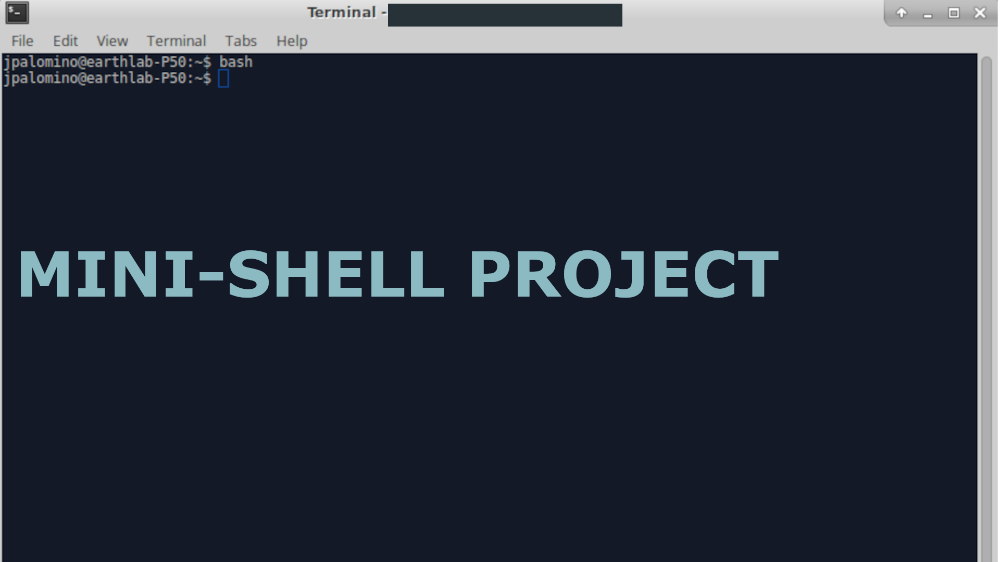

<p align="center">

</p>

# Mini Shell Project 

## Table of Contents
- [Overview](#overview)
- [Features](#features)
- [Installation](#installation)
- [Usage](#usage)
- [Project Structure](#project-structure)
- [Skills Demonstrated](#skills-demonstrated)
- [Contributing](#contributing))
- [Contact](#contact)

## Overview
The **CSC60mshell** is a C-based mini shell program designed as part of Lab 10 for CSC60. This project demonstrates core skills in building command-line interfaces (CLI) and implementing essential system-level programming concepts such as process handling, I/O redirection, and working with built-in shell commands. The shell supports executing external commands, handling custom commands like `pwd`, `cd`, and `exit`, and is capable of parsing and processing user input commands.

This project highlights my proficiency in systems programming with C and the ability to design interactive, user-driven software components.

## Features
- Supports built-in shell commands: `cd`, `pwd`, and `exit`.
- Ability to execute external commands via forking and process execution.
- Command parsing and argument management.
- Handles user input dynamically and continuously through a custom prompt.
- Supports handling of directory changes and printing current working directory.
- Implements error handling for invalid commands.

## Installation
1. Clone this repository:
    ```bash
    git clone https://github.com/yourusername/CSC60mshell.git
    ```
2. Navigate to the project directory:
    ```bash
    cd CSC60mshell
    ```
3. Compile the program using the included `Makefile`:
    ```bash
    make
    ```
4. Run the shell program:
    ```bash
    ./lab10
    ```

## Usage
Once you run the program, the shell prompt will appear as:
```csc60shell>```

You can type in commands such as:
- `pwd` to print the current directory.
- `cd <directory>` to change the current directory.
- `exit` to exit the shell.

The shell will also accept external commands such as `ls`, `gcc`, or any other available commands in your system's path.

Example of usage:
```csc60shell> pwd /home/user/CSC60mshell csc60shell> cd /usr/local csc60shell> ls bin include lib share csc60shell> exit```
## Project Structure
```
CSC60mshell/
│
├── src/                    # Source code files
│   ├── lab10.c             # Main shell implementation
│   ├── RunExtCmd.c         # Handles external command execution
│   ├── ProcessCmd.c        # Processes built-in and external commands
│   ├── Redirection.c       # Handles input/output redirection
│   ├── ParseCmd.c          # Command parsing logic
│   ├── lab9_10.h           # Header file containing constants and macros
├── makefile                # Script to build the project
└── README.md               # This README file
```
## Skills Demonstrated
- **Systems Programming**: Developed a command-line shell application that interacts directly with the operating system, managing processes, and user inputs.
- **Process Management**: Implemented forking and process execution to handle external commands.
- **Command Parsing**: Built custom logic to parse user input, manage arguments, and identify both built-in and external commands.
- **Error Handling**: Added error reporting for invalid commands and unsuccessful directory changes.
- **Makefile Proficiency**: Used a Makefile to streamline the build process, ensuring modular compilation and linking of source files.
- **I/O Redirection**: Incorporated redirection mechanisms to manage input/output for commands.

## Contributing
Contributions are welcome! Feel free to fork this repository, make your changes, and submit a pull request.

## Contact
If you have any questions or suggestions, feel free to contact me at:  

**Vadym Kharchenko**  
Email: vadym.kharchenko@yahoo.com
